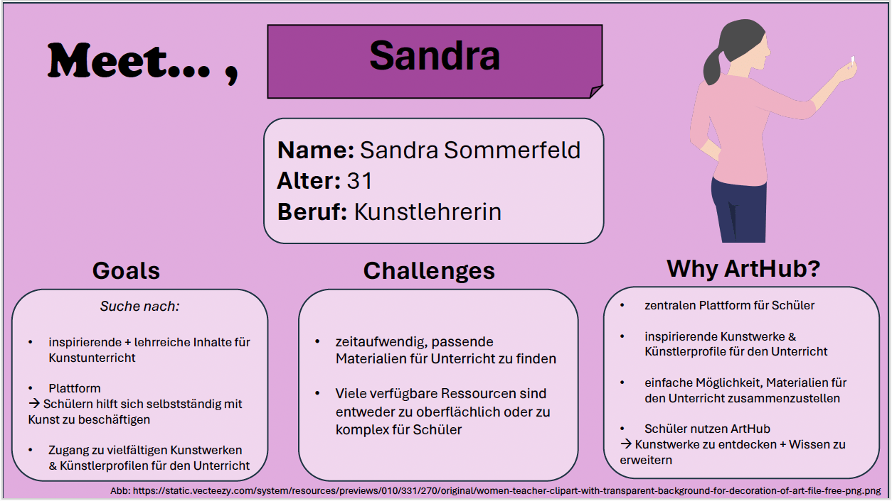
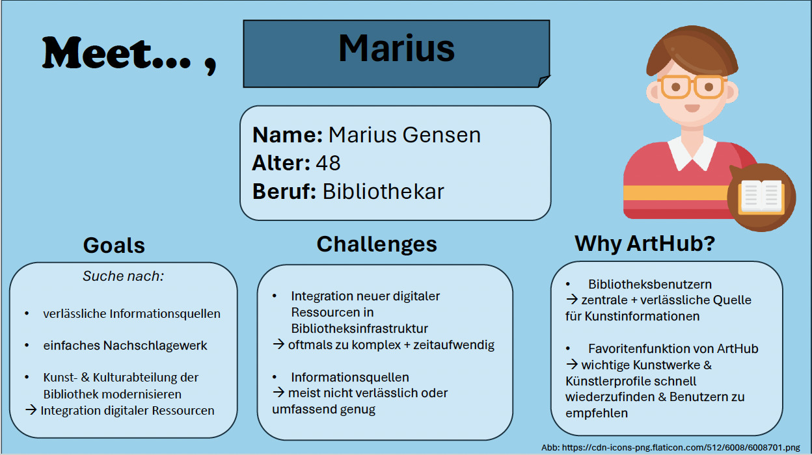

Inhaltsverzeichnis

1. [Home](#home)
2. [Value Proposition](#value-proposition)
3. [Technical Docs](#technical-docs)
4. [Team Evaluation](#team-evaluation)

## Home

# ArtHub

Die ArtHub App ist eine innovative Plattform, die es Kunstinteressierten ermöglicht, in die faszinierende Welt der Kunst einzutauchen. ArtHub zeichnet sich durch seine benutzerfreundliche Oberfläche und einer Datenbank aus. Eine einzigartige Gelegenheit, verschiedene Kunstwerke aus verschiedenen Epochen und Künstlern zu entdecken. Ob für die Renaissance, das Barock, den Kubismus oder andere kunsthistorische Epochen – ArtHub steht euch zur Verfügung. Unsere App dient sowohl als Nachschlagewerk als auch als nützliches Lernwerkzeug. Es bietet nämlich vielfältige und nützliche Informationen über verschiedene Künstler und Zeitepochen. Benutzer haben die Möglichkeit, nach bestimmten Werken zu suchen, um mehr darüber zu erfahren und sich mit verschiedenen Perioden der Kunstgeschichte auseinanderzusetzen. Darüber hinaus ermöglicht es ihnen, ihr Wissen über Kunst zu vertiefen, was insbesondere für den Kunstunterricht oder ein studienbezogenes Fach von großem Nutzen ist. Demnach erfüllt unsere App eine doppelte Funktion und kann sowohl für Anfänger als auch für Experten von Nutzen sein.

## Team members

### Ecem Akbulut

About
: 21-jährige Wirtschaftsinformatik Studentin aus Köpenick.

Matr.-Nr.
: 11918023

### Ivana Caran

About
: 21-jährige Wirtschaftsinformatik Studentin aus Tempelhof.

Matr.-Nr.
: 11974931

## Eidesstattliche Erklärung

Die oben genannten Teammitglieder erklären an Eides statt:

> Diese Arbeit wurde selbständig und eigenhändig erstellt. Die den benutzten Quellen wörtlich oder inhaltlich entommenen Stellen sind als solche kenntlich gemacht. Diese Erklärung gilt für jeglichen Inhalt und umfasst sowohl diese Dokumentation als auch den als Projektergebnis eingereichten Quellcode.

Last build: 18:25 | 23.06.2024 

---

## Value Proposition

Inhaltsverzeichnis

+ [Description](#description)
+ [Persona](#persona)
+ [Value Proposition](#value-proposition)
+ [Goals](#goals)
+ [Ambitions](#ambitions)

### Description

+ Die ArtHub App ist eine informative Kunst App für Kunstliebhaber/innen
+ Kernfunktionen bestehen aus einer Startseite mit Kunstepoche, einer Suchfunktion und einer Favooritensammlung
+ wichtige Informationen und Daten werden übersichtlich und unkompliziert angezeigt
+ User können Informationen unter der Favoritenliste speichern, um schneller auf diese zugreifen zu können
+ Die App bezieht sich auf eine Altersgruppe von klein bis gross: 12-90+ Jahre

### Persona

### Value Propositions

Wir, das ArtHub-Team, haben eine innovative und umfassende App für Kunstliebhaber entwickelt. ArtHub ist mehr als nur eine Plattform – es ist ein Tor zur Welt der Kunst. Unsere App bietet eine reichhaltige Sammlung von Kunstwerken aus verschiedenen Epochen und Stilen, die kunsthistorisch bedeutend sind. Von der Renaissance bis zur modernen Kunst, von Gemälden über Skulpturen bis zu digitalen Kunstwerken – ArtHub bietet einen umfassenden Überblick und detaillierte Informationen zu jedem Kunstwerk und Künstler.

ArtHub ist eine unverzichtbare Ressource für alle, die sich für Kunst interessieren. Unsere Plattform richtet sich sowohl an Neulinge, die gerade erst in die Kunstwelt eintauchen, als auch an Experten, die ihr Wissen vertiefen möchten. Wir bieten nicht nur Informationen, sondern auch Inspiration und Bildung durch eine Vielzahl von Funktionen, die es den Nutzern ermöglichen, Kunstwerke zu entdecken, zu verstehen und zu schätzen.
### The problem

Kunstinteressierte haben oft Schwierigkeiten, umfassende und leicht zugängliche Informationen über Kunstwerke und Künstler aus verschiedenen Epochen zu finden. Bestehende Ressourcen sind fragmentiert und schwer zu navigieren. Es fehlt eine zentrale, benutzerfreundliche Plattform, die eine einfache Suche, detaillierte Informationen und die Möglichkeit bietet, Favoriten zu speichern. ArtHub löst dieses Problem, indem es eine intuitive und umfassende App bereitstellt, die den Zugang zu Kunst und Wissen vereinfacht und das Interesse an Kunst fördert.

### Our solution

ArtHub löst diese Probleme, indem es eine benutzerfreundliche Plattform bietet, die Kunstinteressierten ermöglicht, leicht durch verschiedene Epochen und Kunststile zu navigieren. Die App bietet eine leistungsstarke Suchfunktion, die es Nutzern ermöglicht, gezielt nach Kunstwerken und Künstlern zu suchen. Detaillierte Informationen zu jedem Kunstwerk, einschließlich Titel, Künstler, Epoche und Beschreibung, sowie umfassende Profilseiten für Künstler erleichtern das Verständnis und die Exploration der Kunstgeschichte.

Durch die Favoritenfunktion mit dem "Herz"-Button können Benutzer ihre persönlichen Sammlungen von bevorzugten Kunstwerken und Künstlern erstellen und verwalten. Dies fördert ein vertieftes Engagement und ermöglicht es, inspirierende Werke einfach zu markieren und wiederzufinden.

ArtHub ist darauf ausgelegt, Kunstinteressierte zu unterstützen, ihr Wissen zu erweitern, neue Künstler zu entdecken und eine reichhaltige Sammlung von Kunstwerken zu kuratieren, die sie inspirieren und bereichern.

### Target user

ArtHub richtet sich an eine vielfältige Zielgruppe von Kunstinteressierten, darunter:

Kunstliebhaber und Sammler: Personen, die Kunstwerke sammeln oder sich für Kunst verschiedener Epochen und Stile interessieren.

Studierende und Lehrkräfte: Studenten und Lehrer, die Kunstgeschichte studieren oder unterrichten und eine zuverlässige Quelle für Informationen und Inspiration suchen.

Touristen und Kulturinteressierte: Besucher von Museen und Galerien, die ihr Verständnis und ihre Kenntnisse über Kunst erweitern möchten.

Hobbykünstler und Kreative: Personen, die selbst künstlerisch tätig sind und nach Inspiration und Referenzen suchen.

### Customer journey

1. Einstiegspunkt:
   - Der Nutzer öffnet die ArtHub App.

2. Navigation und Suche:
   - Der Nutzer navigiert durch das Hauptmenü und verwendet die Suchleiste, um nach einem Kunstwerk oder Künstler zu suchen.

3. Suchergebnisse anzeigen:
   - Die App zeigt eine Liste relevanter Suchergebnisse an.

4. Detailansicht anzeigen:
   - Der Nutzer wählt ein Kunstwerk oder einen Künstler aus, um detaillierte Informationen wie Titel, Künstler, Epoche und Beschreibung zu sehen.

5. Favoriten markieren:
   - Der Nutzer markiert Kunstwerke oder Künstler als Favoriten durch den "Herz"-Button.

6. Weiteres Entdecken:
   - Der Nutzer erkundet weiter die App, um mehr Kunstwerke zu entdecken und mehr über Künstler und Epochen zu erfahren.

7. Abschluss:
   - Der Nutzer beendet seine Aufgabe mit einem vertieften Verständnis und einem erweiterten Interesse an Kunst.

Diese vereinfachte Customer Journey zeigt den typischen Ablauf eines Nutzers innerhalb der ArtHub App, beginnend beim Einstieg bis zum Abschluss einer Suche oder Entdeckung.

### Goals

Die Ziele der ArtHub App umfassen:

Benutzerfreundlichkeit: Bereitstellung einer intuitiven Benutzeroberfläche, die es Nutzern ermöglicht, leicht durch verschiedene Kunstwerke und Künstler zu navigieren.

Informationsreiches Erlebnis: Bereitstellung umfassender Informationen zu Kunstwerken, einschließlich Titel, Künstler, Epoche und Beschreibung, um das Verständnis und die Wertschätzung für Kunst zu fördern.

Effektive Suche: Implementierung einer leistungsstarken Suchfunktion, die es Nutzern ermöglicht, gezielt nach Kunstwerken und Künstlern zu suchen und relevante Ergebnisse zu erhalten.

Favoritenverwaltung: Einführung einer Funktion zum Markieren und Verwalten von Favoriten, um Nutzern zu ermöglichen, persönliche Sammlungen von bevorzugten Kunstwerken und Künstlern zu erstellen.

Erweiterung des Kunstwissens: Unterstützung von Kunstinteressierten, ihr Wissen über verschiedene Epochen, Stile und Künstler zu erweitern und zu vertiefen.

Inspiration und Bildung: Bereitstellung einer Plattform, die sowohl für Laien als auch für Experten inspirierend ist und zur Bildung und Entwicklung eines tieferen Verständnisses für Kunst beiträgt.

### Ambitions

Die Ambitionen von ArtHub sind vielfältig und umfassen:

Wachsende Nutzerbasis: Die App strebt danach, eine breite und diverse Gemeinschaft von Kunstinteressierten anzusprechen und zu unterstützen, die Kunst in all ihren Facetten schätzen.

Erweiterung der Datenbank: Kontinuierliche Erweiterung der Kunstwerke und Künstlerprofile in der Datenbank, um eine umfassende Sammlung aus verschiedenen Epochen und Stilen bereitzustellen.

Verbesserung der Benutzererfahrung: Kontinuierliche Optimierung der Benutzeroberfläche und Einführung neuer Funktionen, um das Entdecken und Lernen über Kunst so zugänglich und ansprechend wie möglich zu gestalten.

Internationale Reichweite: Erweiterung der Verfügbarkeit und Lokalisierung der App, um Kunstinteressierte weltweit anzusprechen und kulturelle Vielfalt zu fördern.

Bildung und Wissensvermittlung: Partnerschaften mit Bildungseinrichtungen und Kulturinstitutionen, um ArtHub als wertvolles Werkzeug für den Kunstunterricht und die akademische Forschung zu etablieren.

---

## Technical Docs

[Technical documentation content here]

---

## Team Evaluation

[Team evaluation content here]

