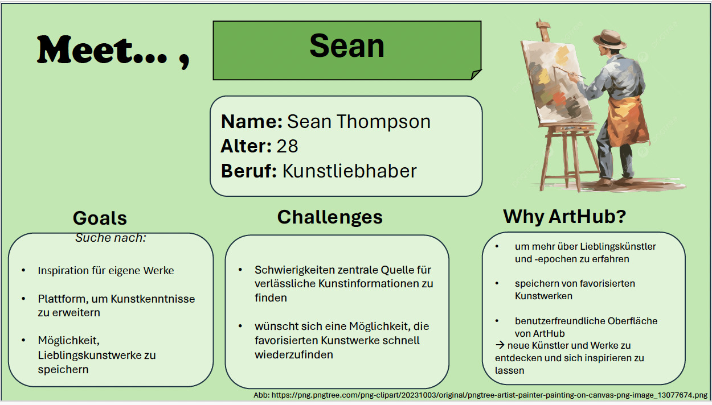
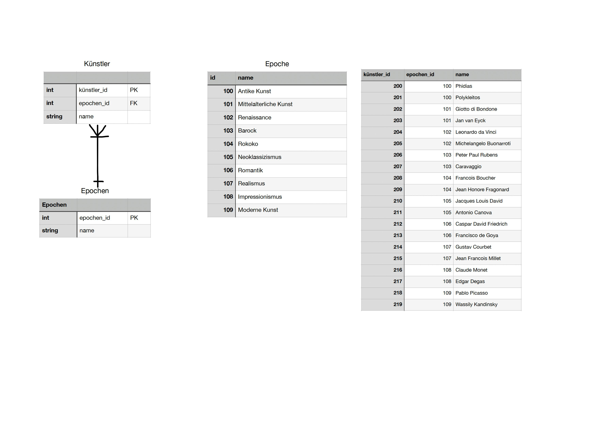
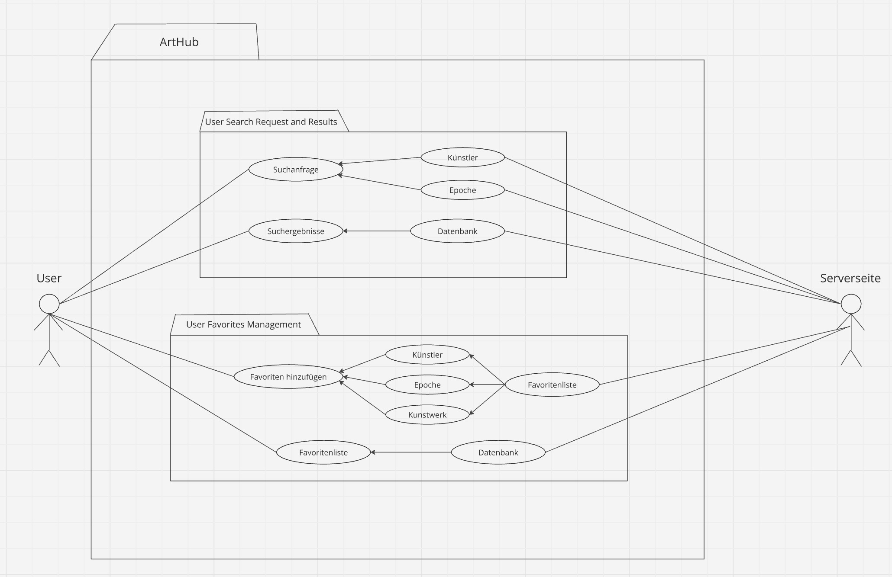
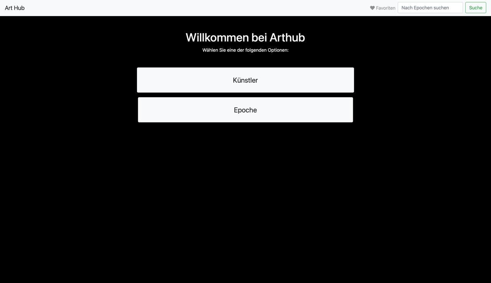
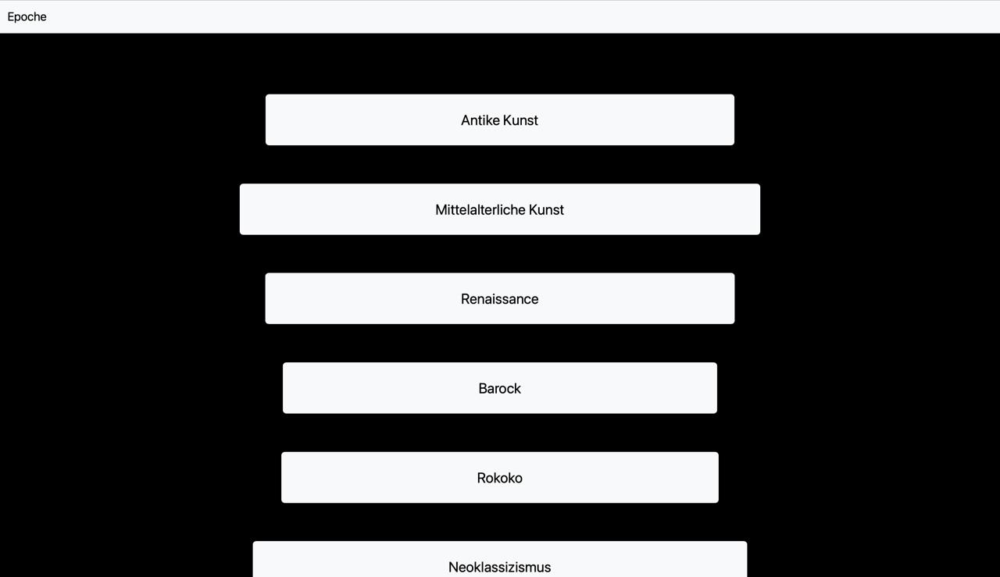
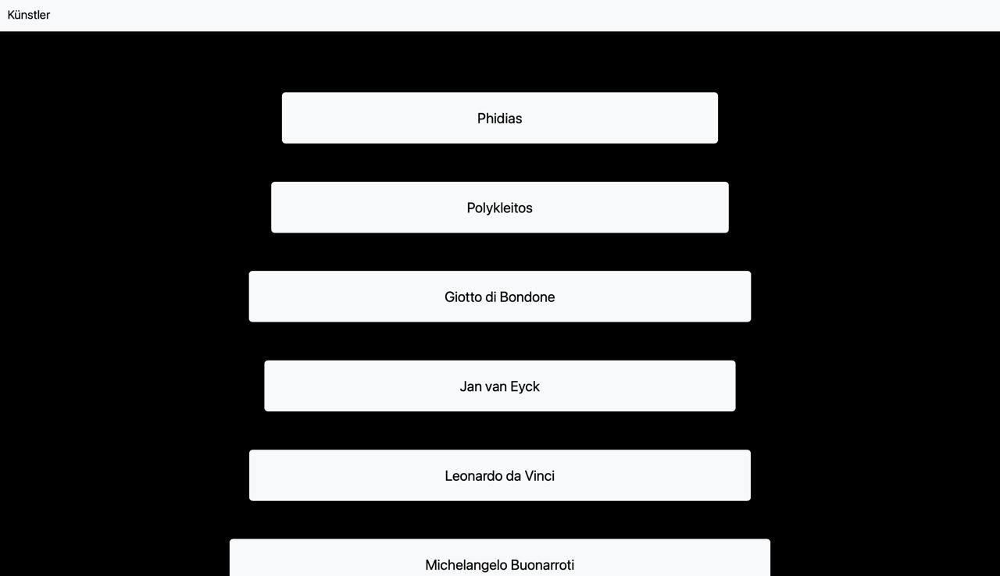
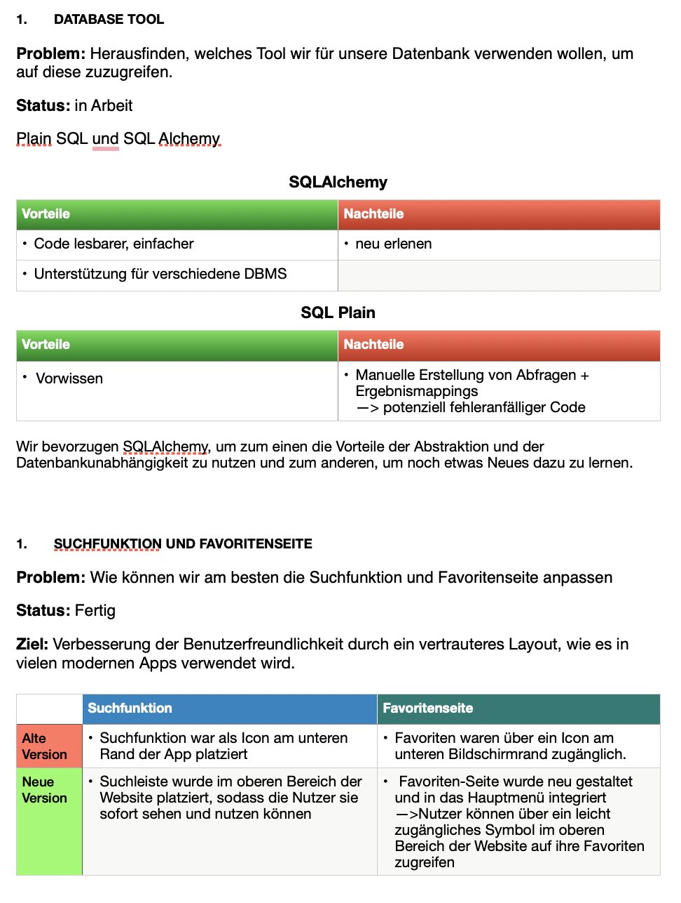

Inhaltsverzeichnis

1. [Home](#home)
2. [Value Proposition](#value-proposition)
3. [Technical Docs](#technical-docs)
4. [Team Evaluation](#team-evaluation)

**Suche:** <input type="text" id="searchInput" placeholder="Suche im Inhaltsverzeichnis..." onkeyup="searchTOC()">

## Team members

### Ecem Akbulut

About
: 21-jährige Wirtschaftsinformatik Studentin aus Köpenick.

Matr.-Nr.
: 11918023

### Ivana Caran

About
: 21-jährige Wirtschaftsinformatik Studentin aus Tempelhof.

Matr.-Nr.
: 11974931

## Eidesstattliche Erklärung

Die oben genannten Teammitglieder erklären an Eides statt:

> Diese Arbeit wurde selbständig und eigenhändig erstellt. Die den benutzten Quellen wörtlich oder inhaltlich entommenen Stellen sind als solche kenntlich gemacht. Diese Erklärung gilt für jeglichen Inhalt und umfasst sowohl diese Dokumentation als auch den als Projektergebnis eingereichten Quellcode.

Last build: 15:25 | 02.08.2024 

---

## Value Proposition

Inhaltsverzeichnis

+ [Description](#description)
+ [Persona](#persona)
+ [Value Proposition](#value-proposition)
+ [Goals](#goals)

### Description

+ Die ArtHub App ist eine informative Kunst App für Kunstliebhaber/innen
+ Kernfunktionen bestehen aus einer Startseite mit Künstlern und Epochen, einer Suchfunktion und einer Favoritensammlung
+ User können Informationen unter der Favoritenliste speichern, um schneller auf diese zugreifen zu können
+ Die App bezieht sich auf Schüler/innen und Anfänger

### Persona

### Target user

Kunstliebhaber und Anfänger: die Kunstwerke sammeln oder sich für Kunst verschiedener Epochen und Stile interessieren

Schüler und Studierende: die Kunstunterricht haben und eine zuverlässige Quelle für Informationen suchen.

### Value Proposition

Unsere App bietet Schülern, Studenten und Anfängern eine klare Übersicht über die Kunstepochen und berühmte Künstler. Emilia und Sean gehören zu zwei Unterkategorien der Zielgruppe mit verschiedenen Interessen und Wünschen. Dennoch können beide von der ArtHub-Seite profitieren, indem sie auf die Daten zugreifen: Emilia für ihr Studium und Sean für sein eigenes Interesse in seiner Freizeit.

**Einzigartiger Nutzen**

*Umfassende Kunstdatenbank*: ArtHub bietet Zugang zu einer breiten Sammlung von Kunstwerken aus verschiedenen Epochen und Stilen.

*Benutzerfreundliche Oberfläche*: Unsere Benutzeroberfläche ermöglicht eine Bereitstellung von Informationen zu Kunstepochen und Künstlern.

*Personalisierte Sammlungen*: Mit der Favoritenfunktion können Nutzer ihre eigene Sammlung erstellen. Diese Funktion ermöglicht es, Informationen schneller wiederzufinden.

*Bildung und Inspiration*: ArtHub dient als wertvolles Lernwerkzeug für Schüler, Studenten und Kunstinteressierte/-anfänger, indem es Informationen und historische Kontexte zu den Künstlern und Epochen bietet. 

**The problem**

Es kann oftmals schwierig sein eine App zu finden, die leicht zugängliche Informationen über Künstler und Kunstwerke aus verschiedenen Epochen bietet.Bestehende Ressourcen sind oftmals schwer zu navigieren oder zu verstehen. Es fehlt eine unkomplizierte, benutzerfreundliche Plattform, die eine einfache Suche, detaillierte Informationen und die Möglichkeit bietet, Favoriten zu speichern. 

**Our solution**

ArtHub löst diese Probleme, indem es eine benutzerfreundliche Plattform bietet, die ermöglicht, leicht durch verschiedene Epochen und Kunststile zu navigieren. Die App bietet eine leistungsstarke Suchfunktion, die es Nutzern ermöglicht, gezielt nach Kunstwerken und Künstlern zu suchen. 
Durch die Favoritenfunktion mit dem "Herz"-Button können Nutzer ihre persönlichen Sammlungen von bevorzugten Künstlern oder Epochen erstellen und verwalten.

### Goals

Die Ziele der ArtHub App umfassen:

Benutzerfreundlichkeit: Bereitstellung einer intuitiven Benutzeroberfläche, die es Nutzern ermöglicht, leicht durch verschiedene Epochen und Künstler zu navigieren.

Informationsreiches Erlebnis: Bereitstellung umfassender Informationen zu Kunstwerken, einschließlich Titel, Künstler, Epoche und Beschreibung, um das Verständnis und die Wertschätzung für Kunst zu fördern.

Effektive Suche: Implementierung einer leistungsstarken Suchfunktion, die es Nutzern ermöglicht, gezielt nach Kunstwerken und Künstlern zu suchen und relevante Ergebnisse zu erhalten.

Favoritenverwaltung: Einführung einer Funktion zum Markieren und Verwalten von Favoriten, um Nutzern zu ermöglichen, persönliche Sammlungen von bevorzugten Kunstwerken und Künstlern zu erstellen.

Erweiterung des Kunstwissens: Unterstützung von Kunstinteressierten, ihr Wissen über verschiedene Epochen, Stile und Künstler zu erweitern und zu vertiefen.
  
---

## Technical Docs

Inhaltsverzeichnis

+ [App Structure](#app-structure)
+ [App Behaviour](#app-behaviour)
+ [App References](#app-references)
+ [Design Decisions](#design-decisions)

### App Structure
**Main Features:**

Suchfunktion: Gezielte Suche nach Künstlern oder Epochen

Umfassende Kunstdatenbank: Zugang zu einer breiten Palette an Informationen aus verschiedenen Epochen und Künstlern

Favoriten und Sammlungen: Möglichkeit, persönliche Favoriten zu erstellen

**Data-Model:**

### App Behaviour

### App References
App routes

### Design Decisions
Current Design:

---

## Team Evaluation

Goals:

Improvements:

Contributions:

