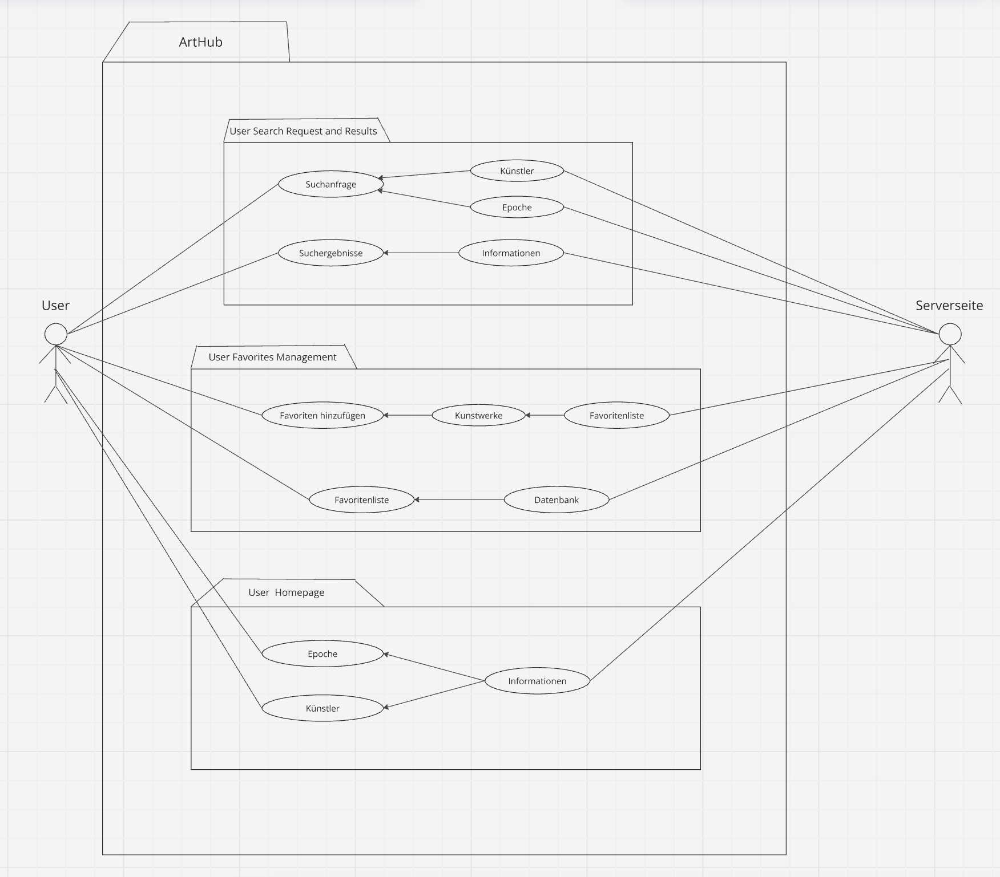

Inhaltsverzeichnis

1. [Startseite](#startseite)
2. [Wertversprechen](#wertversprechen)
3. [Technische Dokumente](#technische-dokumente)
4. [Teamevaluierung](#teamevaluierung)

**Suche:** <input type="text" id="searchInput" placeholder="Suche im Inhaltsverzeichnis..." onkeyup="searchTOC()">

## Teammitglieder

### Ecem Akbulut

About
: 21-jährige Wirtschaftsinformatik Studentin aus Köpenick.

Matr.-Nr.
: 11918023

### Ivana Caran

About
: 21-jährige Wirtschaftsinformatik Studentin aus Tempelhof.

Matr.-Nr.
: 11974931

## Eidesstattliche Erklärung

Die oben genannten Teammitglieder erklären an Eides statt:

> Diese Arbeit wurde selbständig und eigenhändig erstellt. Die den benutzten Quellen wörtlich oder inhaltlich entommenen Stellen sind als solche kenntlich gemacht. Diese Erklärung gilt für jeglichen Inhalt und umfasst sowohl diese Dokumentation als auch den als Projektergebnis eingereichten Quellcode.

Last build: 15:25 | 02.08.2024 

---

## Wertversprechen

Inhaltsverzeichnis

+ [Beschreibung](#beschreibung)
+ [Persona](#persona)
+ [Wertversprechen](#wertversprechen)
+ [Ziele](#ziele)

### Beschreibung

+ Die ArtHub App ist eine informative Kunst App für Kunstliebhaber/innen
+ Kernfunktionen bestehen aus einer Startseite mit Künstlern und Epochen, einer Suchfunktion und einer Favoritensammlung
+ User können Informationen unter der Favoritenliste speichern, um schneller auf diese zugreifen zu können
+ Die App bezieht sich auf Schüler/innen und Anfänger

### Persona

### Zielgruppe

Kunstliebhaber und Anfänger: die Kunstwerke sammeln oder sich für Kunst verschiedener Epochen und Stile interessieren

Schüler und Studierende: die Kunstunterricht haben und eine zuverlässige Quelle für Informationen suchen.

### Wertversprechen

Unsere App bietet Schülern, Studenten und Anfängern eine klare Übersicht über die Kunstepochen und berühmte Künstler. Emilia und Sean gehören zu zwei Unterkategorien der Zielgruppe mit verschiedenen Interessen und Wünschen. Dennoch können beide von der ArtHub-Seite profitieren, indem sie auf die Daten zugreifen: Emilia für ihr Studium und Sean für sein eigenes Interesse in seiner Freizeit.

**Einzigartiger Nutzen**

Benutzerfreundliche Oberfläche: Unsere Benutzeroberfläche ermöglicht eine Bereitstellung von Informationen zu Kunstepochen und Künstlern.

Personalisierte Sammlungen: Mit der Favoritenfunktion können Nutzer ihre eigene Sammlung erstellen. Diese Funktion ermöglicht es, Informationen schneller wiederzufinden.

Bildung und Inspiration: ArtHub dient als wertvolles Lernwerkzeug für Schüler, Studenten und Kunstinteressierte/-anfänger, indem es Informationen und historische Kontexte zu den Künstlern und Epochen bietet. 

**Problem**

Es kann oftmals schwierig sein eine App zu finden, die leicht zugängliche Informationen über Künstler und Kunstwerke aus verschiedenen Epochen bietet.Bestehende Ressourcen sind oftmals schwer zu navigieren oder zu verstehen. Es fehlt eine unkomplizierte, benutzerfreundliche Plattform, die eine einfache Suche, detaillierte Informationen und die Möglichkeit bietet, Favoriten zu speichern. 

**Unsere Lösung**

ArtHub löst diese Probleme, indem es eine benutzerfreundliche Plattform bietet, die ermöglicht, leicht durch verschiedene Epochen und Kunststile zu navigieren. Die App bietet eine Suchfunktion, die es Nutzern ermöglicht, gezielt nach Kunstwerken und Künstlern zu suchen. 
Durch die Favoritenfunktion mit dem "Herz"-Button können Nutzer ihre persönlichen Sammlungen von bevorzugten Künstlern oder Epochen erstellen.

### Ziele

Die Ziele der ArtHub App umfassen:

Benutzerfreundlichkeit: Bereitstellung einer intuitiven Benutzeroberfläche, die es Nutzern ermöglicht, leicht durch verschiedene Epochen und Künstler zu navigieren.

Informationsreiches Erlebnis: Bereitstellung von einfach gehaltenen Informationen zu Kunstwerken, einschließlich Titel, Künstler, Epoche und Beschreibung, um das Verständnis und die Wertschätzung für Kunst zu fördern.

Effektive Suche: Implementierung einer Suchfunktion, die es Nutzern ermöglicht, gezielt nach Kunstwerken und Künstlern zu suchen und relevante Ergebnisse zu erhalten.

Favoritenverwaltung: Einführung einer Funktion zum Markieren und Verwalten von Favoriten, um Nutzern zu ermöglichen, persönliche Sammlungen von bevorzugten Kunstwerken und Künstlern zu erstellen.

  
---

## Technische Dokumente

Inhaltsverzeichnis

+ [App Struktur](#app-struktur)
+ [App Verhalten](#app-verhalten)
+ [App Referenzen](#app-referenzens)
+ [Design Entscheidungen](#design-Entscheidungen)
+ [Quellen](#Quellen)

### App Struktur

**Main Features:**

Suchfunktion: Gezielte Suche nach Künstlern oder Epochen

Kunstdatenbank: Zugang an Informationen aus verschiedenen Epochen und Künstlern

Favoriten und Sammlungen: Möglichkeit, persönliche Favoriten zu erstellen

**Datenmodell:**

### App Verhalten

### App Route

**1. Startseite**
   
Route: /

Methoden: GET

Zweck: Zeigt die Startseite der Anwendung an.

Output:

**2. Künstler**
   
Route: /Kuenstler

Methoden: GET

Zweck: Die Künstler-Seite rendern.

Output:

**3. Epochen**
   
Route: /Epoche

Methoden: GET

Zweck: Die Epoche-Seite rendern.

Output:

**4. Suchfunktion**
   
Route: N/A

Methoden: handleSearch

Zweck: dient der Benutzereingabe im Suchfeld.

Output:

**4.1 Suchfunktion**

Route: /Barock

Methoden: GET

Zweck: rendert die HTML-Seite EpocheBarock.html, die Informationen über die Epoche Barock anzeigt.

Output:

**4.2 Suchfunktion**

Route: N/A

Methoden: alert('Keine Ergebnisse gefunden.'); 

Zweck: Wenn die Suchleiste keiner Epoche bzw. Künstler entspricht wird die Meldung angezeigt

Output:

**5. Favoriten**
   
Route: /Favoriten

Methoden: GET

Zweck: Favoritenseite auf der Startseite anzeigen

Output:

**5.1 Favoriten**

Route: /Favoriten

Methoden: GET

Zweck: Favoriten-Funktion rendert die HTML-Seite Favoriten.html

Output:

**5.2 Favoriten**

Route: /get_favorites

Methoden: GET

Zweck: Zur Favoritenliste hinzufügen

Output:

**5.3 Favoriten**

Route: /add_to_favorites

Methoden: POST

Zweck: Favoriten zur Datenbank hinzugefügt.

Output:

### Design Entscheidungen
**Datenbank Tool**

Problem: Herausfinden, welches Tool wir für unsere Datenbank verwenden wollen, um auf diese zuzugreifen.

Status: Fertig

Plain SQL und SQL Alchemy:
> Plain SQL 
>> Vorteile: Vorwissen
>>> Nachteile: manuelle Erstellung von Abfragen + Ergebnismappings --> potenziell fehleranfälliger Code

> SQL Alchemy
>> Vorteile: Code lesbarer und einfacher, Unterstützung für verschiedene DBMS
>>> Nachteile: neu erlernen

 ➔ Bevorzugen SQL Alchemy, um zum einen die Vorteile der Abstraktion und der Datenbankunabhängigkeit zu nutzen und zum anderen, um noch etwas Neues dazu zu lernen.  
 

**Suchfunktion und Favoritenseite**

Problem: Wie können wir am besten die Suchfunktion und Favoritenseite anpassen?

Status: Fertig

Ziel: Verbesserung der Benutzerfreundlichkeit durch ein vertrautes Layout

Suchfunktion:
> Neue Version: Suchleiste wurde im oberen Bereich der Website platziert, sodass Nutzer sie sofort sehen und nutzen können
>> Alte Version: Suchfunktion wurde als Icon am unteren Rand der App plaziert

Favoritenseite:
> Neue Version: Favoritenseite wurde neu gestaltet und in das Hauptmenü integriert ➔ Nutzer können über ein leicht zugängliches Symbol im oberen Bereich der Website auf die Favoriten zugreifen
>> Alte Version: Favoriten waren über ein Icon am unteren Bilschirmrand zugänglich

➔ Für die Umsetzung haben wir Java-Script verwendet

**Zielgruppe**

Problem: Welche Zielgruppe trifft auf unsere App zu? Inwiefern müssen wir es anpassen?

Status: Fertig

Ziel: genaue Zielgruppe festlegen

Zielgruppe bezieht sich auf auf Schüler, Student und Anfänger, die einen Überblick über Kunst bekommen wollen. 

**Informationen und Daten**

Problem: Wie wollen wir die Daten und Informationen darstellen?

Status: Fertig

Ziel: übersichtliche Darstellung

Wir haben die Informationen so angepasst und gekürzt, dass die wesentlichen Informationen zur Verfügung gestellt werden ohne, dass der Nutzer das Gefühl bekommt von zu viel Text überflutet zu werden. Unser Ziel ist es, klare und prägnante Informationen zu liefern, die leicht verständlich und sofort erfassbar sind.

### Quellen

Bücher:
> Programmieren lernen mit Python und JavaScript von Joachim L. Zuckarelli (2021)

Internetseiten:
> https://learn.microsoft.com/en-us/training/paths/beginner-python/
 
> https://www.w3schools.com

> https://flask-sqlalchemy.palletsprojects.com/en/latest/models/

> https://dev.to/am20dipi/how-to-build-a-simple-search-bar-in-javascript-4onf

Youtube:
> https://www.youtube.com/watch?v=l9u_vm9aAmM

ChatGPT:
> Die Informationen über die verschiedenen Epochen und Künstler wurden durch die Nutzung von ChatGPT gewonnen.
 
> ChatGPT wurde verwendet, um bestimmte Fehlermeldungen auszuwerten und Vorschläge zur Lösung zu machen.

> Bei der Entwicklung und Verbesserung der Favoritenseite hat ChatGPT geholfen.

### Präsentation
Die Präsentation wurde mit Hilfe unserer Website vorgetragen.

---

## Team Evaluierung 

Verbesserungen:
Wir haben einige Punkte, die wir verbessern könnten: Zum einen das Design, das farbiger gestaltet werden könnte. 
Zusätzlich könnte die Möglichkeit geboten werden, die Favoritenliste zu löschen und sicherzustellen, dass die Werke in der Favoritenliste nicht doppelt angezeigt werden, sondern nur einmal.

Beiträge
Wir beide haben am Projekt zusammengearbeitet. Da wir nur zu zweit waren, haben wir uns wöchentlich getroffen und gemeinsam am Projekt weitergearbeitet. Wir empfanden die Aufteilung als fair, da wir in jedem Punkt mitgewirkt haben.
